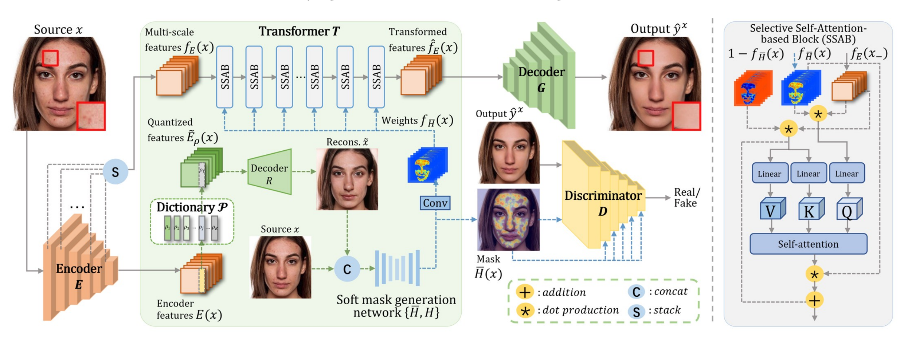

# RetouchFormer: LLM-based Interactive High-Fidelity Face Retouching via Imperfection Prompting



[Wen Xue](https://scholar.google.com.hk/citations?user=OXAPkaEAAAAJ&hl=zh-CN&oi=sra), [Lianxin Xie](https://openreview.net/profile?id=~Lianxin_Xie3), [Le Jiang](https://openreview.net/profile?id=~Le_Jiang3), [Tianyi Chen](https://openreview.net/profile?id=~Tianyi_Chen6), [Chen Liu](https://scholar.google.com/citations?user=RtovsZkAAAAJ&hl=en), [Si Wu](https://scholar.google.com.hk/citations?user=RtkXrnwAAAAJ&hl=zh-CN&oi=sra)*, [Hau-San Wong](https://scholar.google.com.hk/citations?user=i9Dh1OkAAAAJ&hl=zh-CN)<br/>

[South China University of Technology](https://www.scut.edu.cn/en/), [Shantou University](https://www.stu.edu.cn/) [City University of Hong Kong](https://www.cityu.edu.hk/)

This is the official code of **AAAI 2024**: *RetouchFormer: Semi-supervised High-Quality Face Retouching Transformer with Prior-Based Selective Self-Attention*.

<blockquote> <strong>Abstract:</strong> <em>Face retouching is to beautify a face image, while preserving the image content as much as possible. It is a promising yet challenging task to remove face imperfections and fill with normal skin. Generic image enhancement methods are hampered by the lack of imperfection localization, which typically results in incomplete removal of blemishes at large scales. To address this issue, we propose a transformer-based approach, RetouchFormer, which simultaneously identifies imperfections and synthesizes realistic content in the corresponding regions. Specifically, we learn a latent dictionary to capture clean face priors, and predict the imperfection regions via a reconstruction-oriented localization module. Also based on this, we can realize face retouching by explicitly suppressing imperfections in selective self-attention computation, such that local content will be synthesized from normal skin. On the other hand, multi-scale feature tokens lead to increased flexibility in dealing with the imperfections at various scales. The design elements bring greater effectiveness and efficiency. RetouchFormer outperforms the advanced face retouching methods and synthesizes clean face images with high fidelity in our list of extensive experiments performed.</em> </blockquote>

------

## Main contributions:
- We propose a semi-supervised face retouching transformer to reduce the dependence on paired retouching data for model training.
	
- The proposed model, RetouchFormer, is characterized by formulating face retouching as a `soft inpainting' task and realized by joint approximate imperfection prediction and local content synthesis.
	
- Based on clean face priors, the spatial information on imperfections is applied to perform selective self-attention computation, through which the spatial interactions between the queries of imperfections and the key-value pairs of normal skin are strengthened.

------

## Setup Instructions

To run RetouchFormer, follow these steps:

### 1. Install Requirements

- Install and activate the required packages using the requirements.txt file:

  ```
  conda create -n Retouchformer python=3.8
  pip install -r requirements.txt
  ```

### 2. Download Dataset

- Obtain the **Flickr-Faces-HQ-Retouching (FFHQR) Dataset**.

- Arrange the dataset in the following structure:

  ```
  face_retouching/
  ├── train/
  │   ├── source/
  │   └── target/
  └── test/
      ├── source/
      └── target/
  ```

### 3. Train the Model

- Navigate to the project directory and activate the environment:

  ```bash
  cd RetouchFormer
  conda activate retouchformer
  python train.py
  ```


------

## Testing Instructions

To test RetouchFormer:

1. **Navigate to the Project Directory**:

   ```bash
   cd RetouchFormer
   ```

2. **Run the Testing Script**:
   Execute the testing script with:

   ```bash
   python image_retouching.py
   ```

- You can input user instructions and in-the-wild images for retouching purposes.